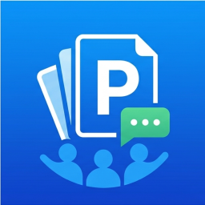
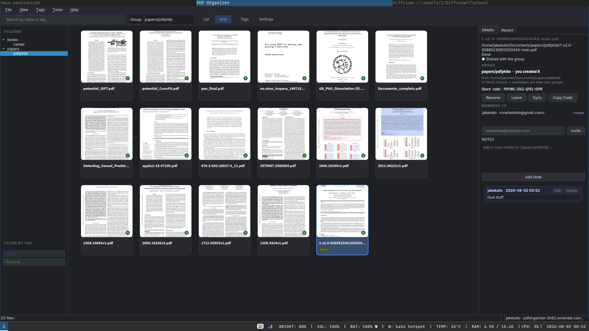

<div align="center">



# PDF Organizer

### Your team's papers, in one place — tagged, discussed, and always in sync.

[](https://www.qt.io/)
[](https://isocpp.org/)
[](https://fastapi.tiangolo.com/)
[](https://www.postgresql.org/)

[](https://github.com/DragMaid/PDFOrganizer/releases)
[](https://github.com/DragMaid/PDFOrganizer/actions)
[](#get-it-running)

[](https://github.com/DragMaid/PDFOrganizer/stargazers)

</div>

---

<div align="center">
  
</div>

---

## 📚 No more "which version of the paper are we on?"

Shared research runs on a shared drive, a group chat, and everyone's memory.
Someone downloads a PDF, renames it `final_v3_REAL.pdf`, drops a thought in
Slack, and three weeks later nobody can find either. The paper is somewhere. The
comment is somewhere else. The person who read it has moved on.

**PDF Organizer puts the file, the tags and the conversation in the same
window.** Point it at a folder, and that folder becomes something your team
shares — same papers, same tags, same notes, on everyone's machine.

---

## ✨ What it does

<table>
<tr>
<td width="50%" valign="top">

### 🗂️ A folder *is* a shared space
Drop in a directory and it becomes a group. Everyone you invite gets the same
papers on their own machine. No upload button hunting, no "did you get it?".

### 🏷️ Tag it your way
One-click chips in the sidebar filter instantly. Tags are shared with the group
and **never conflict** — two people tagging the same paper at the same time just
works.

### 💬 Notes that stay with the paper
Leave a thought on a PDF and your teammates see it next to the file, not buried
in a chat log. Only you can edit your own notes.

### 🔍 Find it in a keystroke
Live search across names and tags. Sortable list view for scanning, card view
with real page thumbnails for browsing.

</td>
<td width="50%" valign="top">

### 🔗 Join with a code
Share a short code (`PDFORG-S5G2-QFR2-45PR`), your teammate pastes it, and their
copy fills in by itself.

### ☁️ Sync that stays out of your way
Uploads run in the background with a live progress bar. Keep tagging, keep
reading — and hammering the sync button won't pile up duplicate work.

### 🟢 Always know where you stand
A coloured dot on every file: **green** it's shared, **amber** it's only on your
machine, **blue** it's moving right now. Tags and notes you write offline queue
up and ride along with the next sync.

### 🌙 Dark by default
Full dark theme, remembered window layout, and a "recently opened" dock so you
can pick up exactly where you stopped.

</td>
</tr>
</table>

---

## 🎯 Built to get out of the way

- **Nothing blocks.** Tagging, commenting and syncing are separate. You never
  have to sync to write a tag, and a sync in progress never freezes the window.
- **Nothing is silent.** Every action lands as a one-line status message instead
  of a modal you have to dismiss. Errors say what went wrong in plain English.
- **Nothing is a mystery.** Hover any file and the tooltip tells you whether the
  group has it, and whether you have edits waiting to go up.
- **Nothing is lost.** Delete a tag and the filter clears itself, the chips
  rebuild, and every file's tag list updates — on your screen *and* on your
  teammates', live over a websocket.

---

## 🚀 Get it running

### Grab a build

Prebuilt binaries for **Linux**, **macOS** and **Windows** are on the
[Releases page](https://github.com/DragMaid/PDFOrganizer/releases).

### Or build it yourself

```bash
git clone https://github.com/DragMaid/PDFOrganizer.git
cd PDFOrganizer
cmake -B build -G Ninja -DCMAKE_BUILD_TYPE=Release
cmake --build build -j$(nproc)
./build/PDFOrganizer
```

<details>
<summary><b>Per-platform prerequisites</b></summary>

| Dependency | Minimum | Notes |
|---|---|---|
| CMake | 3.21 | |
| C++ compiler | GCC 10 / Clang 12 / MSVC 2019 | C++17 |
| Qt | 6.2 | Core, Widgets, Sql, Concurrent, Network, WebSockets |
| Qt PDF | 6.4 *(optional)* | Real page thumbnails instead of placeholders |
| Python | 3.11 | Backend only |
| PostgreSQL | 14 | Backend only |

**Linux (Ubuntu / Debian)**
```bash
sudo apt install cmake ninja-build qt6-base-dev qt6-base-dev-tools \
                 libqt6sql6-sqlite qt6-websockets-dev qt6-pdf-dev
```

**macOS (Homebrew)**
```bash
brew install cmake ninja qt@6
export PATH="$(brew --prefix qt@6)/bin:$PATH"
cmake -B build -G Ninja -DCMAKE_BUILD_TYPE=Release \
      -DCMAKE_PREFIX_PATH="$(brew --prefix qt@6)"
cmake --build build -j$(sysctl -n hw.logicalcpu)
```

**Windows (MSVC + Qt Installer)**
```powershell
cmake -B build -G "Visual Studio 17 2022" -A x64 `
      -DCMAKE_PREFIX_PATH="C:\Qt\6.x.x\msvc2022_64"
cmake --build build --config Release
```
</details>

### The sharing half

Everything shared lives behind a small FastAPI service. Full setup is in
**[`backend/README.md`](backend/README.md)** — the short version:

```bash
cd backend
python -m venv .venv && source .venv/bin/activate
pip install -r requirements.txt
cp .env.example .env          # set PDFORG_JWT_SECRET and the PDFORG_B2_* keys
python init_db.py
uvicorn app.main:app --port 8000
```

Then start the client, sign in, and paste the address into the sign-in sheet.
You can change it later under **Settings ▸ Account**.

> Working solo? Everything local — folders, tags, notes, thumbnails, search —
> works without an account. Sign in only when you want to share.

---

## ⌨️ Shortcuts

| Shortcut | Action |
|---|---|
| `Ctrl+O` | Add folder |
| `Ctrl+1` / `Ctrl+2` | List view / Grid view |
| `Enter` or double-click | Open the selected PDF |
| `Ctrl+Q` | Quit |

---

## 🧩 Under the hood

<div align="center">

```
┌──────────────────────────────┐        ┌──────────────────────────────┐
│  Qt desktop client           │  HTTPS │  FastAPI backend             │
│                              │ ─────▶ │                              │
│  • scans local folders       │  JWT   │  • Postgres (files, tags,    │
│  • renders thumbnails        │   +    │    notes, groups, members)   │
│  • local SQLite cache        │   WS   │  • Backblaze B2 uploads      │
│                              │        │  • enforces who may do what  │
└──────────────────────────────┘        └──────────────────────────────┘
```

</div>

**The client holds no shared credential.** It knows a server address and a
refresh token; Postgres and Backblaze keys live only in the backend's
environment. Everything shared goes through one class, `src/api/ApiClient`, and
nothing else in the client opens a socket.

Files are identified by the **SHA-256 of their contents**, not their path — so
two people holding the same paper in different folders share its tags and notes
automatically, and a given PDF is uploaded exactly once.

<details>
<summary><b>A directory <i>is</i> a group</b> — how sharing units are decided</summary>

Every directory that **directly** holds a PDF becomes its own group, named after
its path below the watched root. There is no other way to put a file in one:
a file's group is decided by which directory it sits in, not by a checkbox.

```
Add /home/me/Papers
├── thesis.pdf             →  group "Papers"
├── 2023/tax.pdf           →  group "Papers/2023"
├── 2023/vat.pdf           →  group "Papers/2023"
└── 2023/receipts/a.pdf    →  group "Papers/2023/receipts"
```

Three directories, three separate groups, each with its own members. A directory
holding only subdirectories gets no group — it's a container, not a sharing
unit. Scanning is recursive, so subfolders become groups without being added by
hand.

The **active group** in the toolbar is derived, not chosen: it's the group of the
directory the selected file sits in. With no file selected, the shared controls
are inert.

| Action | Who may do it |
|---|---|
| Read files, tags and notes | Any member |
| Add files, add/remove tags, write notes | Any member |
| **Edit or delete a note** | **Only its author** — the creator is not exempt |
| Rename the group, invite/remove members | **Only its creator** |
| Leave the group | Any member, of themselves |

Two housekeeping details follow:

- **Names are disambiguated.** `2023` under two roots reads as `Papers/2023` and
  `Invoices/2023`; two roots sharing a basename become `Papers (Work)` and
  `Papers (Home)`.
- **Removing a folder keeps its groups by default.** Un-watching a root is a
  local act spanning several groups. The confirmation says how many and offers
  to delete the ones you created — unticked, so other people's notes are never
  destroyed by accident.

Signing out clears the local id caches. On the next sign-in each directory
re-attaches to the group of the same name you already own, so a round trip
through the login sheet duplicates nothing.
</details>

<details>
<summary><b>How conflicts are handled</b></summary>

The two policies are deliberately opposite.

**Tags never fight.** Adding a tag someone else just added succeeds and changes
nothing; so does removing one they already removed. Names collide
case-insensitively in the database, so the dedup is atomic rather than a
read-then-write race. The one exception is renaming a tag onto an existing
name — merging would silently lose assignments, so that reports a conflict.

**Notes protect authorship.** Edits carry the version the UI displayed. If the
note changed in between, the write is refused and the dialog shows the text that
would have been overwritten instead of losing it.

Every backend failure carries a human-readable `message` the client shows
verbatim, so no failure is silent.
</details>

<details>
<summary><b>Code layout</b> — MVC with dedicated controllers</summary>

```
MainWindow          assembles everything; wires signals & slots
   │
   ├── views/       FolderPanel · ListView · GridView · RecentView · dialogs
   │                  ↓ emit signals upward, never touch the database
   ├── controllers/ PdfController · TagController · FolderWatcher
   │                  ↓ coordinate models, database and services
   ├── models/      PdfModel · TagModel · FolderModel · SearchFilterProxy
   │                  ↓ own in-memory data, view-agnostic
   ├── delegates/   ListDelegate · GridDelegate · SyncBadge
   ├── api/         ApiClient (REST + websocket) · ApiTypes
   ├── database/    DatabaseManager (SQLite)
   └── utils/       PdfOpener · ThumbnailGenerator · SearchFilterProxy
```

**Qt Widgets over QML** — native dialogs and context menus, a mature and
predictable API, simpler deployment, and a better fit for a data-heavy list/grid
UI.

**Async everywhere** — folder scanning and thumbnail rendering both run through
`QtConcurrent::run` and deliver results on the main thread; every backend call
is a non-blocking callback chain.

Local SQLite keeps what is genuinely per-machine — watched folders, scan results,
thumbnails, preferences — plus caches for file content hashes, the backend ids
those hashes map to, and each directory's group.
</details>

<details>
<summary><b>Checking the client and backend agree</b></summary>

```bash
cmake -S . -B build -DBUILD_API_SMOKETEST=ON
cmake --build build --target apiclient_smoketest
./build/apiclient_smoketest http://localhost:8000
```
</details>

---

<div align="center">

**MIT licensed.**

Made for people who read too many papers.

</div>
